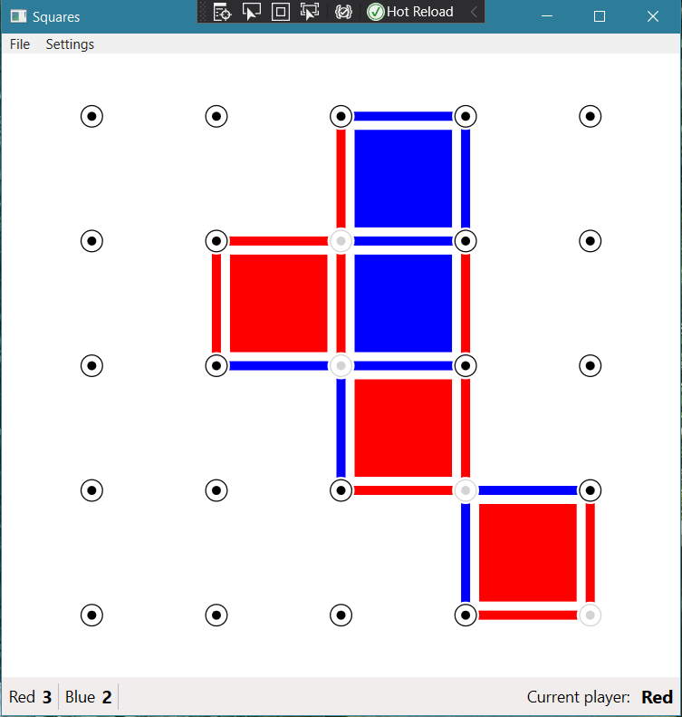
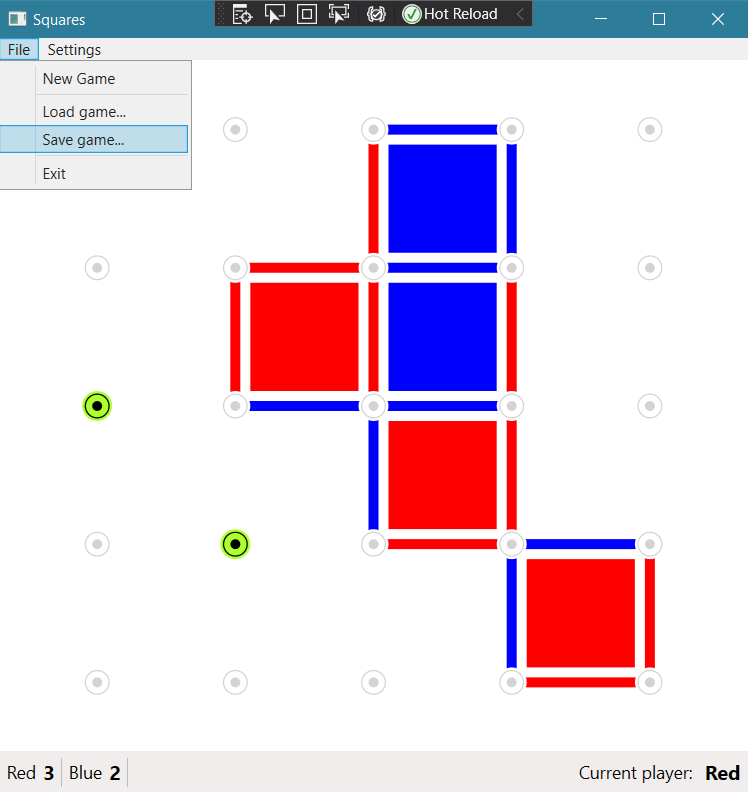

# Connect the dots

## About
Course project for [Event-driven application](https://mcserep.web.elte.hu/elte/eva).
A connect the dots like game where whoever can complete the most squares wins.

Written in C# using Windows Forms, WPF and Xamarin frameworks.

## Screenshots

